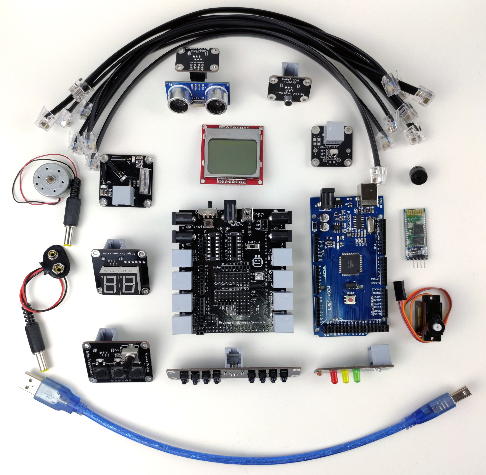
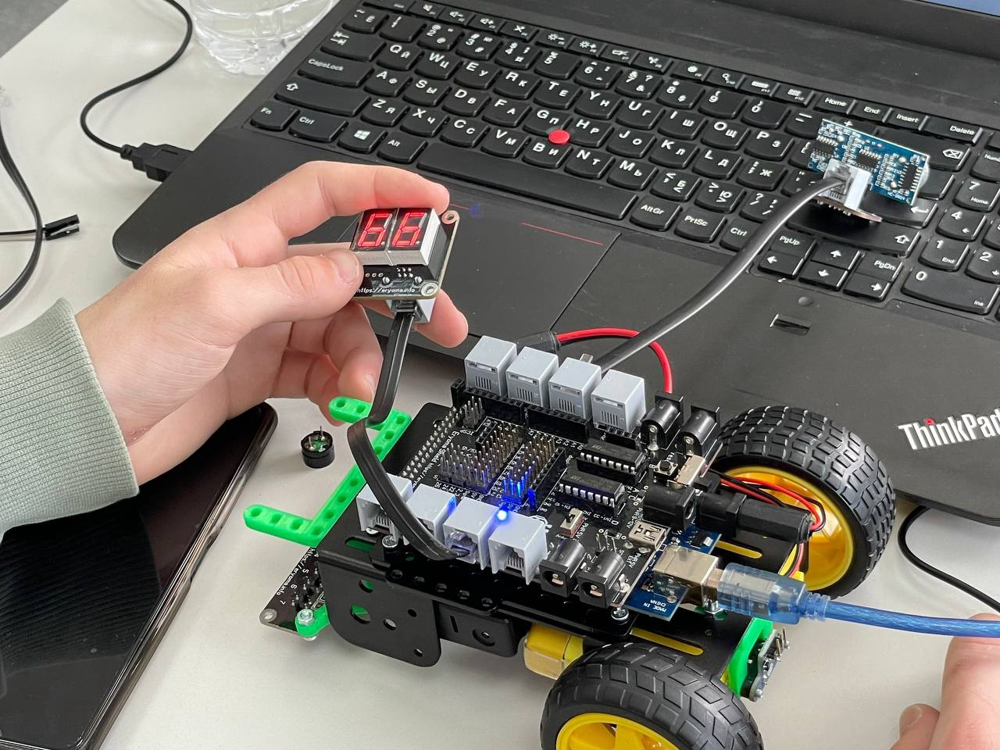

# Образовательный конструктор Ерёма

Данный конструктор основан на платформе arduino, он позволяюет быстро и просто создавать различные образовательные проекты.

## Фотографии

## Автор
[Попов Виталий](https://github.com/Totalexx)
